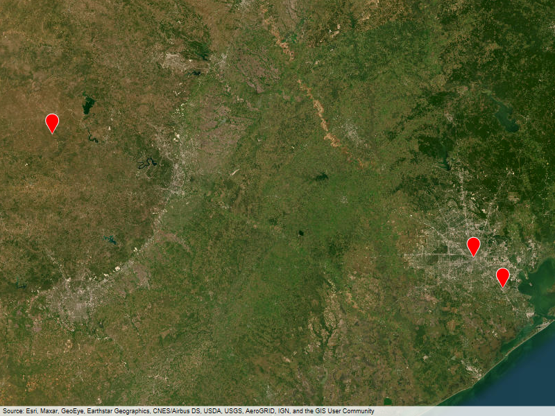
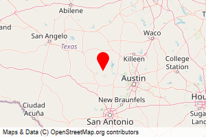
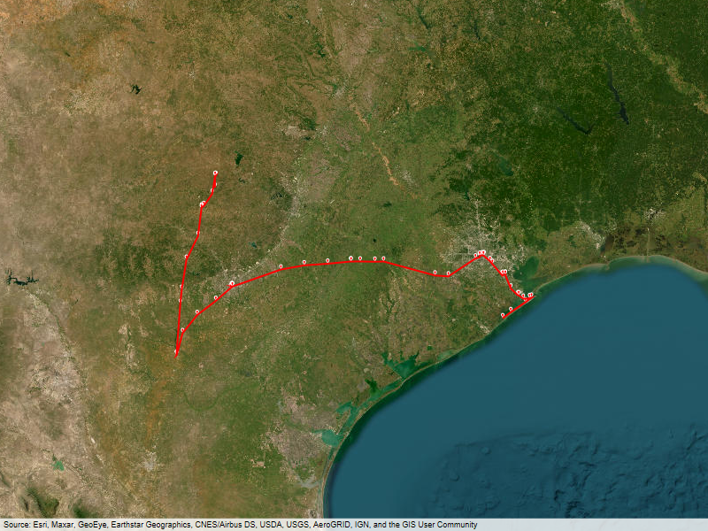

# PS_extract
Python script to extract Polarsteps data from JSON files to text file, local browsable html files or emails

## Introduction
If you use the [Polarsteps (PS)](https://www.polarsteps.com/) application to keep records of your journeys, you probably wanted to get your data back to be sure you have them outside the cloud, or to use them in other contexts. PS provides a [nice way to get all data and pictures from your account in a zip file](https://support.polarsteps.com/article/124-how-can-i-export-a-copy-of-my-data), but handling the information stored in these JSON files is quite inconvenient.
This script has been written to solve this and to help you extract all useful information from these JSON files automatically.
Furthermore it allows you to get the results in several formats:
- a txt file describing all steps and listing pictures and videos associated
- local html files allowing to simply browse all the steps of your trip (with all information grabbed from PS, gallery of photos and videos and generated maps)
- generated emails sent to a chosen address to populate automatically a blog

## Pre-requisites
[Python](https://www.python.org/) 3.8+ should be installed on your system.
This script needs also some libraries that should be installed prior to execution :
- [dateutil](https://github.com/dateutil/dateutil) : `pip install python-dateutil` ; this allows timezone management
- [pillow](https://pypi.org/project/pillow/) : `pip install Pillow` ; this allows picture manipulations
- [pycairo](https://pypi.org/project/pycairo/) : `pip install pycairo` ; this allows anti-aliased maps
- [staticmaps](https://github.com/flopp/py-staticmaps) : `pip install py-staticmaps[cairo]` ; this allows map generation

(if you do not install pillow, pycairo or staticmaps the script will detect it and will not generate maps)

Also download your PS data and unzip it in a convenient place for you.

## Installation
You just need to copy the `extract.py` script at the root directory of the trip you want to extract.
(the zip file downloaded from PS contains all your recorded trips in separated folders, each trip folder contains 2 files (``locations.json`` and ``trip.json``) and as many additionnal folders as steps in your trip. These folders contain photos and videos files related to each step)

## Execution
Run this program with the following command :

``python3 (/path_to_program_directory/)extract.py [options]``
    
The program will create an ``Extracts`` directory and extract in it all information from your Polarsteps data in a readable text file (.txt), and automatically generated static maps (PNG files) of your trip and steps.
In addition, you can choose to generate localy browsable HTML pages to navigate through your steps, and/or generate emails for each step (with text, images and videos from your steps). It is possible to extract data step by step in interactive mode, or to generate all files for the whole trip.

Here are the additional options that could be combined and put at launch:
+ ``-v``, ``-verbose`` :                  to add additional information in the generated text file
+ ``-l``, ``-local`` :                    to generate local html files to navigate the steps
+ ``-e``, ``-email myaddress@domain.com`` : to send emails containing description, images and videos from extracted steps to the given address (for example to fill a blog like blogger or wordpress using postie plugin) ; consider putting your common email server parameters directly in the script to avoid having to type them everytime you execute the script 
+ ``-i``, ``-interactive`` :              to display an analysis and interactively ask what to do for each step (skip, email, continue or quit)
+ ``-x``, ``-exclude`` :                  to exclude the first and last steps from generated maps presenting the whole trip (allow to focus the map when origin country is far away)
                           
anything else will display help.

## Results
All generated files are stored in ``Extracts`` folder created at execution (inside your trip folder, at the same level than ``locations.json`` and ``trip.json`` files).

The [example](example/trip/usa-2024_10825444) folder provides a trip sample with 
+ corresponding files from zip file from PS (``/trip/usa-2024_10825444/...``)
+ resulting files after execution of the script (``python3 extract.py -v -l``) in [Extracts](example/trip/usa-2024_10825444/Extracts) folder

In all cases :
+ ``{trip_name}_{trip_start_date}.txt`` : generated text file with all trip/steps information. For example, ``USA 2024_2024-04-09.txt`` for a trip which name is 'USA 2024', started on 2024 April 09th.
  
If local html option is activated :
+ ``index.htm`` : main html page with trip information, 1 image, step name and link to step page for each step 
+ ``local.css`` : CSS file applied to all html files ; you can change easily global appearance by modifying it
+ ``{step_id}.htm`` : page providing information on one step, with all photos and videos (viewable in a gallery) and links to main page and previous and next steps. For example, ``98177523.htm`` for the step which ID is 98177523 in PS.
  
If local html option or email option is activated :
+ ``steps_map.png`` : generated map with one marker for each step location
  
  
+ ``map_{step_id}.png`` : generated map centered on one step. For example, ``map_98177523.png`` for the step which ID is 98177523 in PS.

  
+ ``trip_map.png`` : generated map with all locations tracked by Polarsteps and paths between them

  

If email option is activated, the following emails will be generated and sent to the specified address :
+ step email : one email per step with information from the step, photos and videos of the step attached, and the generated map for this step
+ trip email : one global email with the trip information, and steps map attached

## Contributions
First steps of extracting PS data were done through https://github.com/adamlporter/PolarSteps python script, giving me the basic elements to build this more featured script. 
